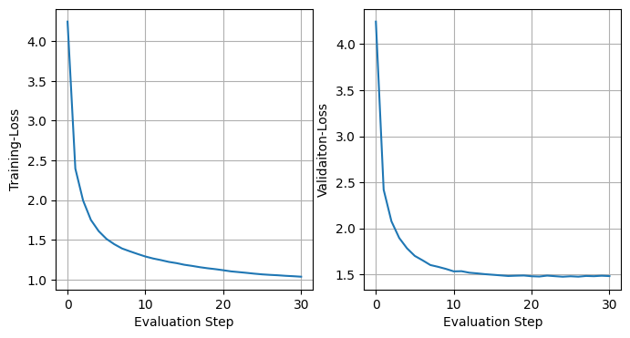

# Implementing GPT02 Type decoder from Andrej Karpathy's Lectures on YouTube

## Trained a vectorized self-attention based GPT-02 Decoder on Tiny Shakespeare dataset 

### Loss curves


### [Output](demo.txt) from the model

```
Do not because the life on the rebels,
I have deserved with no quite and dargems.
If it be daughter, I sever'd well-been secret
And therefolds sight 't:' be the preciound
That to the Edward blindness, and masks him;
The same our aid, and let perille,
I pleade you banished him: if my loyal,
Doing out an in hour uprincets of pirect
To famish'd opposite thy fall,
We are colours in our daughter's womb in:
'antily, not raged me too, so much show'd her
Undon your counterse must to a father's.

BRUTUS:
O lamentation!
Ere farewell: for well.

SICINIUS:
He come upon, hither
Most abotial.

CORIOLANUS:
Come, that's it face:
What batters it is come to Braught with Laurenca?
Why, what? then, Warwick, and thy war
That makes rapkind by the people
In thee service and cennice myself. Was now
none, fulless, stood issieges, that followers;
these was bed induke, who still, thou knows
is, anon his child: why, I cannight;
Yet therefore have he beet worthip the
sings begue after?

AUTOLYCUS:
This fly, they
'Tis a man, I pray yours; and welcome.

Clown:
Sir, farewell, sir.

First Senator:
Clarence, amaudiers:
His letters at he is himself and forsworn; so he
see his with upon buttery footing thunded
the crown rest numbering and husbands. Ned,
Her dresses, sir, away wither: the ferruon'd, as I didslive not
knowledges over thy heafe, wonder you, you
not upon my aum: good neither says Withwalt
crims our sift and with neced love; 'tis he
truly fear'--a briddle-plot sold all baggage!--what fan?
We art thou desired by the maidens?
But wilt then mine hath call'd him him?
```