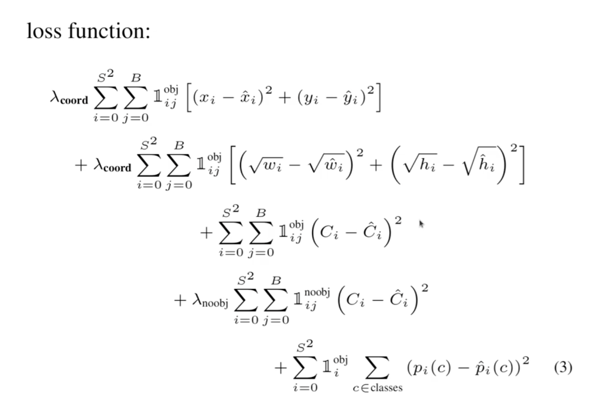

# Implementing YOLOv1 in PyTorch from scratch

## How does YOLO work ?
- Yolo is an object detection model, which outputs bound boxes for the objects detected in the image 

### Internal Working
1. YOLO divides the input image in SxS grid cells (S=7 in the original paper)
2. Objects may have presence in multiple cells but the center point of the object defines the dedicated cell boundary for that object
3. Each output and label will be relative to the cell, where each cell is scaled between 0 and 1
4. The output [x,y,w,h] will be the mid points of the object relative to the cell followed by widht and height of the cell. x,y are between 0 and 1 but w and h can be greater than 1 depending upon the containment of the object in the bbox 
5. For each object the labels will be [c1,c2,.....,cn,pc,x,y,w,h], where c_i will be the class label for ith class, pc is the confidence probability and x,y,w,h are the above the discussed labels 
6. Target shape: (S,S,5) Prediction shape: (S,S,30)

### Loss - Function

